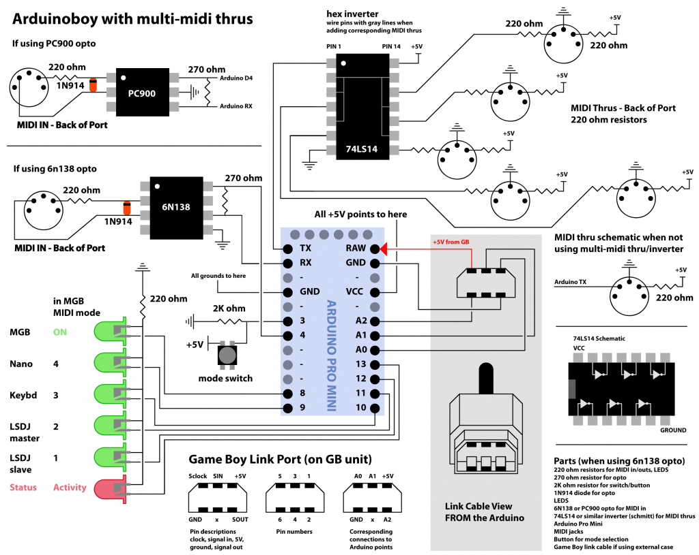
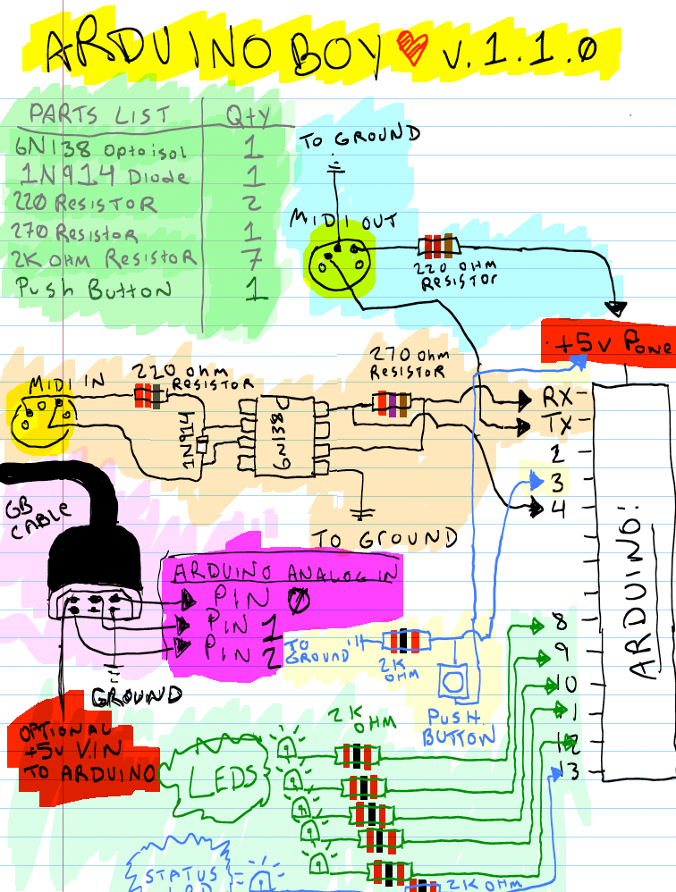

# Arduinoboy
Official ArduinoBoy Repository for serial MIDI communication to the Nintendo Gameboy.

## About 
Arduinoboy is software for the [Arduino hardware platform](http://arduino.cc) that allows serial communication (MIDI) to the Nintendo Gameboy for music applications such as [LittleSoundDJ](http://littlesounddj.com), [Nanoloop.](http://www.nanoloop.com/), and [mGB](https://github.com/trash80/mGB)

## Video Demos

  * [Keyboard Mode Test](http://youtube.com/watch?v=TnLUuvc78XY)
  * [Sync Demos](http://youtube.com/watch?v=iVmhy-Lo7BI)
  * [Arduino inside of Gameboy DMG](http://youtube.com/watch?v=VwrMuOA0VnY)
  * [mGB Example & Arduinoboy build into a DMG](http://vimeo.com/1853931)
  * [PDF explores mGB with a MIDI guitar](http://www.youtube.com/watch?v=HAU9MzZ2qeE)

## Current Features
  * Affordable and easily accessible parts for assembly.
  * Accurate MIDI Sync, Start and Stop commands.
  * Push Button to select the sync/state mode (7 modes available)
  * LSDJ as MIDI Slave Sync with sync effects and midi note transport control. Also Note value to LSDJ song position row offset on Song Start.
  * LSDJ as MIDI Master Sync. Send Midi sync with LSDJ, LSDJ also sends a Midi Note on message that corresponds to the song row number

  * LSDJ PC Keyboard mode. with the first octave controlling M-U-T-E, Cursor control (LSDJ Live mode only), Table selection and table cue.
  * MIDI to Nanoloop sync
  * Full MIDI with mGB (Details below)
  * LSDJ LIVE MAP ... incoming MIDI notes cue LSDJ row numbers, requires custom LSDJ version on the LSDJ site.
  * LSDJ MIDIOUT ... sends MIDI out from LSDJ, requires custom LSDJ version on the LSDJ site.
  * Midi Out Doubles as a Midi Thru
  * "Filtering" data for only sync messages, no dedicated MIDI line required.
  * Tested and works with DMG (Original), Gameboy Color, and Advance/SP.
  * Can be powered by the gamelink port.
  * USB upgradeable via Arduino.
  * mGB Cartridge Mode: Full MIDI in support across all Gameboy Channels, including a unique "poly" mode. Tested and works with DMG01, GBC, GBA, GB AdvanceSP

## Future Features & wishlist
  * Build instructions, and a Arduino Shield

## Program Information
 * LSDJ Slave Mode Midi Note Effects:
  * 48 - C-2 Sends a Sequencer Start Command
  * 49 - C#2 Sends a Sequencer Stop Command
  * 50 - D-2 Toggles Normal Tempo
  * 51 - D#2 Toggles 1/2 Tempo
  * 52 - E-2 Toggles 1/4 Tempo
  * 53 - F-2 Toggles 1/8 Tempo
 * LSDJ Keyboard Mode:
  * 36 - C-1 Mute Pu1 Off/On
  * 37 - C#1 Mute Pu2 Off/On
  * 38 - D-1 Mute Wav Off/On
  * 39 - D#1 Mute Noi Off/On
  * 40 - E-1 Livemode Cue Sequence
  * 41 - F-1 Livemode Cursor Up
  * 42 - F#1 Livemode Cursor Down
  * 43 - G-1 Livemode Cursor Left
  * 44 - G#1 Livemode Cursor Right
  * 45 - A-1 Table Up
  * 46 - A#1 Table Down
  * 47 - B-1 Cue Table
  * 48 - C-2 to C-8 Notes!
  * Prgram Change to select from instrument table
 * Default Midi channel is 16. You can change in the top of the main source file in the archive. 

## Schematics

## Thanks To
  * [Arduino](http://arduino.cc)
  * [Nitro2k01](http://gameboygenius.8bitcollective.com nitro2k01) for ASM help with mGB 
  * [GWEM](http://www.preromanbritain.com/gwem/lsdj_midi/g33k.html) g33k page
  * [Midines](http://wayfar.net) Thanks for the help x|k!
  * [firestARTer](http://www.firestarter-music.de) help with keyboard & Midi handling information. 
  * [Gijs Gieskes](http://gieskes.nl) Found source code that gave insight into Nanoloop sync
  * [Little Sound DJ](http://littlesounddj.com)
  * [http://devrs.com/gb](http://devrs.com/gb) Madcatz PC link port for gb serial specs
  * [http://chipmusic.org](http://chipmusic.org) For all things Chipmusic.
